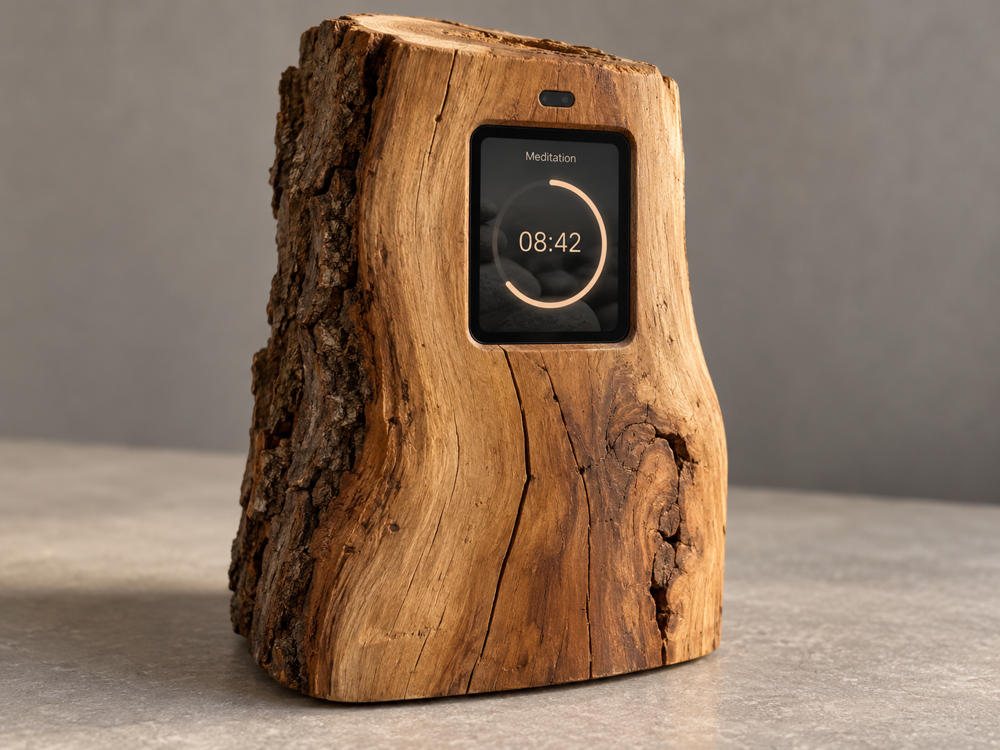

# ZenTimer



*KI-generierter Designentwurf für Gehäuse und Oberfläche; keine Aufnahme des aktuellen Prototyps.*

ZenTimer ist ein kleiner Meditationstimer für einen festen Platz im Alltag.
Man stellt die Zeit ein, beginnt die Sitzung und lässt den Kreis langsam
schließen. Die Anzeige bleibt ruhig: gut lesbare Ziffern, ein warmer
orangefarbener Bogen und dunkle Steine im Hintergrund.

Die Idee ist ein Gerät, das sich selbstverständlich in ein natürliches Stück
Holz einfügt. Die Technik soll sich zurücknehmen und den Beginn und das Ende
der Meditation begleiten. Der Entwurf oben zeigt diese Richtung; das Projekt
wächst derzeit aus einem funktionierenden Hardware-Prototypen heraus.

> Der Timer soll nicht bedient werden. Man wendet sich ihm zu, beginnt – und
> danach tritt er wieder zurück.

Langfristig soll eine bewusste Annäherung die Sitzung vorbereiten. Wenn die
Hände wieder entfernt werden, erklingt ein Anfangsgong; ein Schlussgong
beendet die Meditation. Touch bleibt als einfache Möglichkeit für Einrichtung
und direkte Bedienung erhalten. Annäherungserkennung und Audio sind noch
geplante Schritte.

Heute läuft ZenTimer auf einem Seeed XIAO nRF52840 mit dem Waveshare
1,69-Zoll-Touchdisplay. Die Startdauer beträgt 20 Minuten. In Bereitschaft
ändern die grauen Minus-/Plus-Symbole die Dauer zwischen 1 und 60 Minuten;
ein Tap in der Mitte startet. Weitere einzelne Taps pausieren und setzen
fort, ein Doppeltipp bricht ab. Am Ende steht `00:00` im geschlossenen Kreis,
und die Hintergrundbeleuchtung blinkt dreimal.

Die Firmware mit Roboto-Ziffern, Steinmotiv und dem dezenten
Hintergrundring wurde am 07.10.2026 erfolgreich geflasht. Der neue Build ergänzt
Gerätemenüs und dauerhafte Sitzungsablage; dessen Hardwareabnahme steht noch aus.
Die Anzeige nutzt
Hardware-SPI mit 8 MHz; die bewährte Software-SPI-Ansteuerung bleibt als
Rückfalloption erhalten. Timerlogik, Anzeige und Eingabe sind getrennt, damit
sich die Gestaltung und die spätere Hardware weiterentwickeln können.
Ein Mac-Simulator verwendet denselben C++-Timerkern für die Entwicklung ohne
angeschlossenes Gerät.

Die [bebilderte Anschlussanleitung](docs/wiring.md#bebilderte-anschlussanleitung)
beschreibt Steckerorientierung, Signalzuordnung und die stromlose Prüfung.
Im [Hardware-Dokument](docs/hardware-demo.md) stehen Bedienung, Build-Befehle,
Farbtest, Rückfalloption und die noch zu dokumentierenden Abnahmeprüfungen.
Der aktuelle Entwicklungsbranch ist `feature/timer-core`.

## Menüs und Sitzungshistorie

In Bereitschaft die Mitte eine Sekunde halten: Das Menü bietet Dauer-Profile,
Anzeigeoptionen, **Gespeicherte Sitzungen** und Daten/System. Restzeit und
Steinbild lassen sich abschalten, die Helligkeit ist einstellbar. Einträge in
der Historie zeigen aktive Dauer, geplante Zeit und Abschluss beziehungsweise
Abbruch. Die Aufzeichnungen bleiben auch ohne Strom erhalten.

Die [Anleitung zu Speicherung und Export](docs/sessions.md) erklärt die
Bedienung, Uhrzeit ohne RTC und die Mac-Bridge. Sie archiviert Sitzungen lokal
in SQLite und erzeugt eine Open-Sit-Datei für den manuellen Timefully-Import.
Ein eigener Server-Upload ist optional konfigurierbar; es wird keine
Timefully-Synchronisierungs-API vorausgesetzt. Bluetooth und Audio sind
vorerst ausgespart.

## Aufbau und Verhalten

- `TimerCore.h`: reine C++-Timerlogik ohne Arduino- oder I/O-Abhängigkeiten.
- `SerialConsole.h/.cpp`: USB-Serial-Befehle und Statusausgabe.
- `SessionJournal.h`, `SessionStore.h/.cpp`: prüfsummengesicherte Flash-Ablage.
- `DeviceMenu.h/.cpp`: Geräte-Menüs und lesbare Sitzungshistorie.
- `tools/session_bridge.py`: lokales Archiv, Open-Sit-Export und optionaler Upload.
- `TimeSource.h`: austauschbare monotone Millisekundenquelle.
- `ZenTimer.ino`: verbindet Timer, Serial, Anzeige und Touch mit einer
  `millis()`-Zeitquelle. Keine Wartezeit auf USB und keine blockierende
  Eingabelese-Schleife; feste Resetwartezeiten gibt es nur beim Hardwarestart.

Zustände: **bereit**, **läuft**, **pausiert**, **beendet**. Standarddauer auf dem
Gerät: **20 Minuten** (1200 Sekunden), eingestellt in `ZenTimer.ino`. Der unveränderte Timerkern und
Mac-Simulator starten weiterhin mit 10 Minuten. Auf dem Gerät werden die zuletzt
eingestellte Dauer und Anzeigeoptionen im externen Flash wiederhergestellt.
Pausen zählen nicht zur Meditationsdauer. Der Timer läuft auch bei getrenntem
Monitor weiter. `cancel` setzt ihn auf bereit mit der eingestellten vollen Dauer.
Nach beendet beginnt `start` eine neue Sitzung mit derselben Dauer.

Unsigned Differenzen von `millis()` behandeln den Überlauf nach etwa 49,7 Tagen.
Die Hauptschleife muss mindestens einmal pro Überlaufperiode aufgerufen werden.
Restsekunden werden aufgerundet, damit 0 erst bei tatsächlichem Ende erscheint.

## Serielle Bedienung

115200 Baud; Befehle in Kleinbuchstaben mit Enter abschließen. LF, CR und CRLF
werden akzeptiert. Maximal 63 Zeichen pro Zeile; längere Zeilen werden verworfen.

| Befehl | Wirkung |
| --- | --- |
| `duration 600` | Dauer in ganzen Sekunden setzen (1–86400); nur bereit/beendet, setzt auf bereit |
| `start` | Aus bereit/beendet starten |
| `pause` | Laufenden Timer pausieren |
| `resume` | Pausierten Timer fortsetzen |
| `cancel` | Aus jedem Zustand abbrechen/zurücksetzen |
| `status` | Zustand, eingestellte Dauer und Restsekunden ausgeben |
| `help` | Befehle anzeigen |
| `menu` | Gerätemenü in Bereitschaft öffnen |
| `sessions` | Letzte gespeicherte Sitzungen lesen |
| `storage` / `info` | Speicher, Geräte-ID und Uhrzeit anzeigen |
| `time <Unix-Sekunden>` | Kalenderzeit für diesen Gerätestart setzen |
| `export` | Gespeicherte Sitzungen per USB ausgeben; Anleitung in [sessions.md](docs/sessions.md) |

Beispiel: `duration 60`, `start`, `pause`, `status`, `resume`, `cancel`
(jeweils eine eigene Zeile). Ungültige Befehle, Werte oder Übergänge erzeugen
eine Fehlermeldung. Ist die Dauer beim Pausieren bereits abgelaufen, bleibt
der Zustand beendet.

Beim Verbinden erscheinen Hilfe und Status. Weitere Ausgaben erfolgen bei
Befehlen/Zustandswechseln und während des Laufs alle fünf Sekunden. Bereit,
pausiert und beendet erzeugen keine regelmäßigen Ausgaben.

## Build und Monitor (macOS)

Schnellstart im Projektverzeichnis, ohne angeschlossenes Gerät:

```sh
./build.sh
```

Das Skript setzt den Python-PATH und kompiliert nach `build/arduino`; es flasht
nichts. Alternativ in VS Code **Run Build Task → ZenTimer: Build**.


Verwendete Umgebung: Arduino CLI 1.5.1, Seeeduino:nrf52 Core 1.1.13,
Python 3.13.7. `~/.local/bin/python` verweist auf Python; dieser Ordner muss
für den Build im PATH sein. Sketchordner und Hauptdatei heißen `ZenTimer` bzw.
`ZenTimer.ino`.

```sh
PATH="$HOME/.local/bin:$PATH" arduino-cli compile \
  --fqbn Seeeduino:nrf52:xiaonRF52840Sense --build-path build/arduino .
arduino-cli board list
arduino-cli monitor --port /dev/cu.usbmodem2401 --config baudrate=115200
```

Den aktuellen Port vor Monitorstart und jedem späteren Upload prüfen;
`/dev/cu.usbmodem2401` ist nur der zuletzt bekannte Port. Build und Monitor
laden keine Firmware hoch. Der Monitor benötigt die Timer-Firmware auf dem Board; sie ist inzwischen
auf dem angeschlossenen XIAO installiert.

In VS Code den Projektordner `ZenTimer` öffnen. **Run Build Task** startet
`ZenTimer: Build` mit dem nötigen PATH. Unter **Run Task** stehen zusätzlich
`ZenTimer: USB Ports` und `ZenTimer: Serial Monitor` mit Portabfrage bereit.
Den Monitor mit Ctrl+C beenden. Es gibt absichtlich keinen Upload-Task.

Der hardwareunabhängige Test prüft Zustandsübergänge, Pause, Abbruch,
Neustart, Dauergrenzen, Ablauf beim Pausieren und den Zeitüberlauf:

```sh
c++ -std=c++11 -Wall -Wextra -pedantic tests/timer_core_test.cpp \
  -o /tmp/zentimer-core-test
/tmp/zentimer-core-test
```

## Grafischer Simulator (macOS, ohne Hardware)

Der native Simulator verwendet **AppKit/Cocoa** mit Objective-C++ und bindet
dieselbe Datei `TimerCore.h` wie die Firmware ein. Es gibt keine zweite
Timerimplementierung und keine JavaScript-Abhängigkeit. AppKit zeichnet den
Kreisbogen mit [NSBezierPath](https://developer.apple.com/documentation/appkit/nsbezierpath/appendarc%28withcenter%3Aradius%3Astartangle%3Aendangle%3Aclockwise%3A%29).
Dies ist eine funktionale UI-Simulation, keine nRF52840-Emulation.

Benötigt werden macOS und Apples **Xcode Command Line Tools** (Clang/C++ und
macOS-SDK mit Cocoa). Diese sind auf diesem Entwicklungsrechner vorhanden.
Bei einer neuen Einrichtung mit `xcode-select --install` installieren.
Keine Homebrew-Grafikpakete, Arduino-Hardware oder Python sind für den
Simulator erforderlich.

Im Projektordner starten:

```sh
sh simulator/run.sh
```

Alternativ in VS Code **Run Task → ZenTimer: Simulator**. Der Task kompiliert
und öffnet das Fenster. `ZenTimer: Simulator Build` kompiliert nur.
Beenden über das Fenster oder Cmd+Q. Das Programm liegt unter
`build/simulator/ZenTimerSimulator`; Arduino nutzt separat `build/arduino`,
damit dessen Build-Bereinigung den Simulator nicht entfernt.

Bedienung mit der Maus:

- Dauer in ganzen Sekunden eingeben, dann **Übernehmen** oder **Start**.
  Start übernimmt auch eine noch unbestätigte Eingabe. Werte: 1–86400 Sekunden.
- **Start**, **Pause**, **Fortsetzen**, **Abbrechen** entsprechen den
  Zustandsübergängen des gemeinsamen Kerns. Während Lauf/Pause ist die
  Dauer gesperrt; zum Ändern erst abbrechen.
- **Restzeit anzeigen** blendet die Zeit in der Kreismitte ein oder aus.
- **Zeitablauf** wählt 1×, 10× oder 60×. Ein Wechsel erzeugt keinen Zeitsprung;
  Pausen zählen auch im beschleunigten Modus nicht.

Der Fortschrittsbogen beginnt leer bei 12 Uhr und wächst im Uhrzeigersinn
bis zum geschlossenen Kreis am Ende. Er verwendet die millisekundengenaue
Restzeit, die Textanzeige aufgerundete Sekunden im Format Minuten:Sekunden.
Die Oberfläche aktualisiert mit etwa 30 Hz. Das Fenster hat einen neutralen
Hintergrund; `TimerView::drawRect` ist die Stelle für ein späteres statisches
Steinmotiv. Das Fenster ist zunächst bewusst nicht größenveränderbar.

`TimerCore` erhält eine `TimeSource&`, deren Lebensdauer den Timer umfasst.
Die Firmware liefert `millis()`, der Simulator verwendet
`std::chrono::steady_clock` und skaliert nur die Zeitquelle. Die Zeit wird als
Millisekunden modulo 2³² geliefert; Ablauf und Pausen berechnet weiterhin
ausschließlich der Kern. Schlaf-/Ruhezustand des Macs ist kein simulierter
Gerätestandby und wird nicht gesondert modelliert.

Zusätzlicher deterministischer Test für Beschleunigung, Geschwindigkeitswechsel,
Überlauf und Pausen mit dem gemeinsamen Kern:

```sh
c++ -std=c++17 -Wall -Wextra -pedantic tests/simulator_clock_test.cpp \
  -o /tmp/zentimer-clock-test
/tmp/zentimer-clock-test
```

Automatisierter GUI-Smoke-Test (benötigt eine macOS-Grafiksitzung):

```sh
sh simulator/build.sh
./build/simulator/ZenTimerSimulator --self-test
```

Er prüft die Bedienelemente und rendert eine Halbzeit-Vorschau des Kreisbogens nach
`build/simulator/preview.png`. Danach beendet er sich wieder.

## Spätere Erweiterungen

Waveshare 1,69-Zoll-Touch-LCD und CST816S-Touch sind angeschlossen und laut
Hardwaretests einzeln bestätigt. Der neue Präsentations-Build verbindet sie
mit dem Timerkern und ist geflasht; die vollständige Hardwareabnahme ist noch
nicht dokumentiert. Proximity-Sensor
und LiPo sind vorhanden; genaue Varianten sind noch offen. Audio, Sensorsteuerung,
Sleep und automatische Synchronisierung sind noch nicht implementiert.
Lokale Sitzungsspeicherung und manueller Open-Sit-Export sind jetzt vorhanden.

Der Fortschrittskreis und das statische Steinmotiv sind bereits umgesetzt.
Die Restzeit lässt sich im Gerätemenü zuschalten. Als weiterer
gestalterischer Schritt ist ein handgemalter Ensō denkbar. Geplant sind Timefully-Profilimport,
Zeitanpassung am Gerät und Rückübertragung von Sitzungen. Automatische
Synchronisierung ist ein Ziel; eine verfügbare Schnittstelle ist bislang nicht
nachgewiesen. Es wird keine API angenommen.
