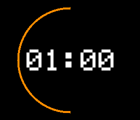

# ZenTimer: 2-Minuten-Präsentations-Build

Branch `feature/timer-core`. Der erste integrierte Build wurde auf das Gerät geladen und vom Nutzer
getestet. LCD, CST816S-Touch und kontinuierliche Drag-Koordinaten sind laut
neuem Hardware-Handoff bestätigt. **Die hier dokumentierte Folgeversion mit
Kreis, Minus/Plus und Abschlussblinken ist kompiliert, lokal getestet und am
06.10.2026 auf `/dev/cu.usbmodem2401` geflasht. Der Uploader bestätigte
„Device programmed.“ Auch die aktuelle Minus-/Plus-Version wurde erfolgreich auf diesen Port
geflasht. Die vollständige Funktionsabnahme ist noch nicht protokolliert.** Der vorhandene `Displaytest/Displaytest.ino`
bleibt unverändert; der Mac-Simulator verwendet weiterhin denselben Timerkern.



*Ältere Vorschau aus dem C++-Renderingtest, kein Hardwarefoto. Die aktuelle
Version verwendet weichere Ziffern und einen geglätteten Bogen; in Ready
kommen graue Minus-/Plus-Symbole hinzu. Für diese Änderung wurden auf Wunsch
keine lokalen Tests oder neuen Vorschau-Renderings ausgeführt.*

## Bedienung und Anzeige

Nach dem ersten Bildaufbau steht `02:00` mittig auf Schwarz. In Ready sind
links ein dezentes graues Minus und rechts ein Plus sichtbar. Außerhalb von
Ready verschwinden beide. Zustandslabels und Menüs bleiben ausgeblendet.

| Zustand | Bedienung |
| --- | --- |
| Ready | Links: −1 Minute; rechts: +1 Minute; Mitte: kurzer Tap zum Starten |
| Running | Kurzer Tap pausiert |
| Paused | Kurzer Tap setzt fort |
| Finished | Kurzer Tap setzt zurück auf Ready |

Die Dauer bleibt allein im TimerCore gespeichert. Grenzen werden geklemmt,
nicht umgebrochen. Die bisherigen Serial-Befehle bleiben erhalten; sie können
weiterhin andere Sekundenwerte setzen. Minus/Plus addiert/subtrahiert dann
60 Sekunden und klemmt das Ergebnis auf 60–3600 Sekunden.

Der **orangefarbene Kreis ersetzt den linearen Balken vollständig**. Sein
Bogen startet unten bei 6 Uhr und wächst im Uhrzeigersinn: unten → links →
oben → rechts → unten. Bei 50 % ist die linke Hälfte sichtbar, am Ende der
Kreis geschlossen. Er zeigt verstrichene Meditationszeit; Pause zählt nicht
mit. Der Bogen wird in 2°-Schritten aktualisiert, mit weichen Kanten und runden
Bogenenden. Die Zeit verwendet abgerundete, geglättete Segmentziffern. Die weißen Ziffern bleiben
mit Abstand innerhalb des Kreises. Auf dem aktuellen logischen 280 × 240
Bild beträgt der Radius der Strichmitte 104 Pixel, die Strichbreite ungefähr
3 Pixel mit geglätteten Randpixeln. Der Orangeton ist etwas wärmer.
Dies ist ein geometrischer Zwischenstand, kein nachgezeichneter Ensō.

`TimerCore::remainingSeconds()` rundet unverändert auf: Bei 120 Sekunden bleibt
anfangs `02:00` für die erste Sekunde stehen. Die Zeitmessung läuft unabhängig
von der Displayübertragung. USB Serial bei 115200 Baud bleibt aktiv, auch bei
fehlendem Touchcontroller. Beim Verbinden wird dessen Konfigurationsstatus
angezeigt; erkannte Eingabeaktionen geben einmal ihre logische Position aus.

**Abschluss:** Erst nachdem `00:00` und der vollständige Kreis übertragen
wurden, blinkt nur die Hintergrundbeleuchtung D6: aus/an, aus/an, aus/an;
je Phase 300 ms, anschließend dauerhaft an. Inhalt und Farbe bleiben während
aller Phasen gleich. Wiederholte Updates in Finished starten das Blinken nicht
neu. Ein Tap zurück auf Ready beendet eine laufende Blinkfolge und schaltet
wieder auf dauerhaft an. `CompletionBlink` verwendet unsigned Zeitdifferenzen,
kein `delay()` und keine TimerCore-Änderung.

## Aufbau

- `TimerCore` und `TimeSource` bleiben unverändert und hardwareunabhängig.
- `TimerActions.h` kapselt die gemeinsame Aktivierungsaktion für Touch und
  einen späteren Sensor.
- `TimerDisplay` rendert Zeit und Fortschrittskreis in einen nativen
  RGB565-Framebuffer (134400 Byte) und verwendet nur `DisplayDriver`.
- `St7789SoftwareSpi` übernimmt Bitfolge, 1-µs-Halbzyklen, Resetwartezeiten und
  Minimalinitialisierung aus dem bestätigten `Displaytest`.
- `TouchInput` liest CST816S-Kontakte über Wire und übergibt sie an
  `TouchGesture`. Diese gibt genau eine semantische Aktion beim Loslassen aus.
  Die ISR setzt nur ein Flag; I²C findet in der Hauptschleife statt.

Die LCD-Initialisierung bleibt bei `01`, `11`, `3A=55`, `36=00`, `13`, `21`,
`29`. Fenster verwenden `2A`, `2B` mit Y-Offset +20 und `2C`. Keine zusätzlichen
Prospector-Register, keine Adafruit-ST7789-Bibliothek und kein Hardware-SPI.

Nach dem vollständigen Erstaufbau werden nur geänderte Zeit- und Bogenbereiche
als zusammenhängende Rechtecke übertragen. Der vorhandene Framebuffer bleibt
für die zentrale Drehung und konsistente Regioneninhalte erhalten. Die Ursache
der bisher beobachteten Artefakte ist weiterhin ungeklärt; weder lokale
Schreibzugriffe noch ein anderer Treiber gelten dadurch als bewiesen gut oder
schlecht. Es wurde dafür kein weiterer Buffer oder neuer Treiber eingeführt.
Während einer Region bleibt CS LOW; pro Hauptschleife werden höchstens
96 Pixel gesendet. Zwischen diesen Paketen laufen Timer, Serial und Touch.
Der Framebuffer wird während der Übertragung nicht verändert. Neue sichtbare
Werte werden nach Abschluss übernommen; unter Last können Sekunden ausgelassen
werden. Die tatsächliche Übertragungsdauer muss auf der Hardware geprüft werden.
Identische Inhalte lösen keine erneute Übertragung aus.

## Orientierung und Touch

Die einzige Einstellung ist `BoardConfig::Rotation` in
`hardware/BoardConfig.h`. Vorgabe: `Clockwise`, logische Anzeige **280 × 240**.
Der Controller bleibt nativ **240 × 280** mit `MADCTL=0x00`.

Für diesen Modus bildet `ScreenGeometry` native Koordinaten auf
`screenX = 279 - rawY`, `screenY = rawX` ab; die inverse Transformation wird
für das Zeichnen verwendet. Das folgt aus der Beobachtung „native Oberkante
liegt physisch rechts“. Ob die gewünschte Geräteaufstellung genau so gemeint
ist, bleibt ein Hardwareprüfpunkt. Andere Vierteldrehungen werden zentral
unterstützt. Touch außerhalb der nativen Grenzen wird verworfen, nicht an den
Bildrand geklemmt. Es wird angenommen, dass CST-Rohkoordinaten zur nativen
LCD-Ausrichtung passen; das muss anhand der Ecken überprüft werden.

Bestätigte Pins: LCD DIN D10, CLK D8, CS D9, DC D7, RST D3, BL D6;
Touch SDA D4, SCL D5, **IRQ D0, RST D1**. Die Dokumentation und
Verbindungsskizze wurden gegenüber dem früheren Anschlussentwurf korrigiert.

Der Touchcontroller wird auf Kontakt-/Änderungs-IRQ eingestellt
(`IrqCtl 0xFA = 0x60`, EnTouch + EnChange). Aus Register 0x02 werden Fingerzahl
und Rohposition gelesen. Laufende Kontakte werden mit einem Mindestabstand von
15 ms abgefragt; der tatsächliche Abstand hängt von der Hauptschleife ab.
Die Transformation erfolgt ausschließlich über `ScreenGeometry`.
[Quelle: Waveshare CST816S-Registerbeschreibung](https://files.waveshare.com/wiki/common/CST816S_register_declaration.pdf).

In Ready belegen Minus und Plus jeweils den gesamten linken/rechten
64-Pixel-Streifen des logischen 280 × 240 Bilds. Die Symbole selbst sind
bewusst klein. Der 152-Pixel-Bereich dazwischen bleibt für den Start-Tap.
Die Seiten reagieren sofort auf den ersten gültigen Kontakt, ohne auf ein
Loslass-Signal zu warten. Der Kontakt wird anschließend verbraucht: kein
Autorepeat und kein zusätzlicher Start-Tap beim Loslassen.

In der Mitte und außerhalb von Ready wird ein Tap beim Loslassen erkannt:

- Bewegte Kontakte werden nicht als Tap behandelt; Wischgesten werden von
  der aktuellen Oberfläche nicht zur Dauersteuerung verwendet.
- Höchstens 500 ms und maximal 14 Pixel Bewegung: Tap.
- Halten, seitliches Gleiten oder Bewegung weg und zurück: keine Tap-Aktion.
- Fehlerhafte I²C-Lesevorgänge oder ungültige Kontaktkoordinaten verwerfen den
  Kontakt; fehlende Daten werden nicht als Loslassen interpretiert.
- Nach einem Kontakt werden neue Kontakte innerhalb von 120 ms verworfen,
  um Kontaktprellen zu unterdrücken. Controller-GestureID-Berichte werden nicht
  zusätzlich in Aktionen umgesetzt; damit gibt es keinen zweiten Start-Tap nach
  dem Drücken von Minus oder Plus.

Am Gerät ist insbesondere zu bestätigen, dass Kontakt-IRQ und Fingerzahl 0
beim Loslassen mit der neuen IRQ-Einstellung zuverlässig geliefert werden.

## Kompilieren und unabhängiger Farbtest

Keine neuen Bibliotheken erforderlich: Seeeduino:nrf52 1.1.13 liefert Arduino,
TinyUSB und Wire. Wie bisher muss `~/.local/bin` für Python im PATH sein.

```sh
PATH="$HOME/.local/bin:$PATH" arduino-cli compile \
  --fqbn Seeeduino:nrf52:xiaonRF52840Sense --build-path build/arduino .
```

VS Code: **ZenTimer: Build**. Der unabhängige Farbmodus verwendet denselben
Treiber und wiederholt Rot → Grün → Blau → Weiß → Schwarz. Jede Farbe bleibt
nach vollständiger Übertragung mindestens eine Sekunde sichtbar. Touch steuert
in diesem Modus keine Sitzung; es werden keine UI-Regionen gezeichnet.

```sh
PATH="$HOME/.local/bin:$PATH" arduino-cli compile \
  --fqbn Seeeduino:nrf52:xiaonRF52840Sense --build-path build/color-test \
  --build-property compiler.cpp.extra_flags=-DZENTIMER_COLOR_TEST=1 .
```

VS Code: **ZenTimer: LCD Farbtest Build**. Zur Timer-UI zurückkehren, indem
ohne diesen Build-Schalter gebaut wird. Beide Tasks kompilieren nur.
Vor einem späteren, ausdrücklich ausgelösten Upload den USB-Port mit
`arduino-cli board list` neu prüfen und den Monitor schließen.

## Lokale Prüfung und Abnahme am Gerät

```sh
c++ -std=c++11 -Wall -Wextra -pedantic tests/timer_core_test.cpp \
  -o /tmp/zentimer-core-test && /tmp/zentimer-core-test
c++ -std=c++17 -Wall -Wextra -pedantic tests/simulator_clock_test.cpp \
  -o /tmp/zentimer-clock-test && /tmp/zentimer-clock-test
c++ -std=c++11 -Wall -Wextra -pedantic tests/timer_display_test.cpp \
  TimerDisplay.cpp -o /tmp/zentimer-display-test && /tmp/zentimer-display-test
c++ -std=c++11 -Wall -Wextra -pedantic tests/interaction_test.cpp \
  -o /tmp/zentimer-interaction-test && /tmp/zentimer-interaction-test
```

Die Tests prüfen die Drehungen, übertragenen Pixel, fehlende redundante
Updates, Rundung, Kreisstart/-richtung/-abschluss, zentrale Zeit und die
Rückkehr vom Farbtest. Eingabetests prüfen Swipe/Tap-Trennung, Grenzen,
Zustandssperren, ungültige Kontakte und Zeitüberlauf. Der Anzeigetest prüft
zusätzlich das vollständige Abschlussbild vor Blinkbeginn, genau drei
OFF/ON-Paare, unveränderte Pixel während des Blinkens, kein erneutes Starten
in Finished und Abbruch der Blinkfolge beim Reset.

Prüfergebnis der vorherigen Kreis-/Swipe-Version: alle vier C++-Tests bestanden,
auch Firmware und Farbtest bauten erfolgreich. Aktueller Minus-/Plus-Build:
63964 Byte Flash / 142216 Byte RAM; Arduino-Kompilierung erfolgreich. Lokale
Tests wurden für diese Änderung auf ausdrücklichen Wunsch nicht ausgeführt;
die bestehenden Test-Erwartungen sind für eine spätere Ausführung angepasst. Das sind statische Build-Angaben,
keine gemessene Laufzeitreserve. Die ST7789-Minimalinitialisierung ist unverändert.

Für die Abnahme der geflashten Version am Gerät prüfen:

1. Schrift und Kreis stehen richtig; sie überlappen nicht. Kein Balken mehr.
2. In Ready links/rechts drücken: ±1 Minute, Minimum 1, Maximum 60 ohne Wrap.
   Auch seitliche Berührungen deutlich ober-/unterhalb der Symbole ausprobieren.
3. Halten auf Minus/Plus ändert die Dauer einmal. Loslassen startet nicht;
   ein separater kurzer Tap in der Mitte startet genau einmal.
4. Außerhalb von Ready sind Minus/Plus verborgen und ändern die Dauer nicht.
5. Pause hält Zeit und Kreis; Fortsetzen zählt korrekt weiter.
6. `00:00` mit geschlossenem Kreis; danach exakt drei ruhige Lichtblinks,
   ohne Löschen, neue Grafik oder erneutes Blinken beim Warten.
7. Tap setzt auf die eingestellte Dauer zurück. Auch Reset während eines
   OFF-Intervalls schaltet das Licht wieder an.
8. Serial funktioniert während Displaytransaktionen. Für einen schnellen
   Abschluss aus Ready `duration 5`, dann `start` verwenden.
9. Unabhängigen Farbtest bei Artefakten vergleichen; nicht gleichzeitig
   Treiber, Transport und Initialisierung wechseln.

Ensō, Gong, Proximity, Energiesparen, Synchronisierung und ein Hardwarewechsel
bleiben spätere Schritte. D2 ist für einen möglichen Sensor-Interrupt frei;
Audio benötigt anschließend eine bewusste Planung des knappen Pinbudgets.
